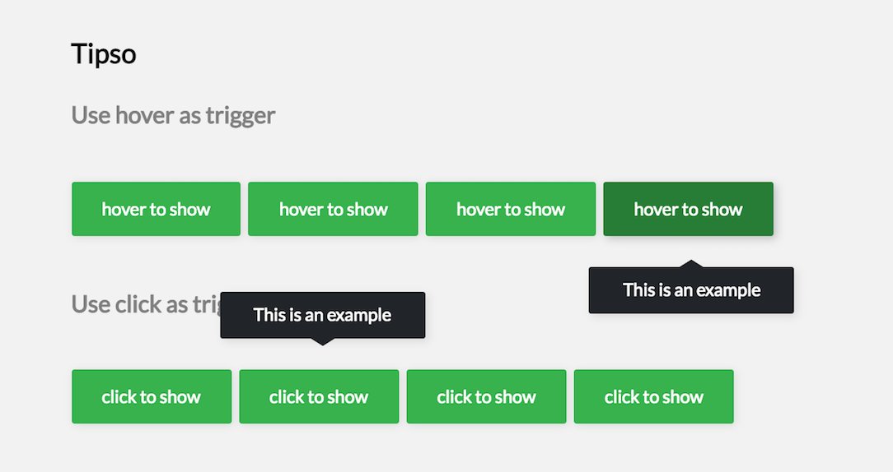

# React Tipso

[](https://badge.fury.io/js/rc-tipso)  [](http://standardjs.com) [](https://www.npmjs.com/package/rc-tipso) [](https://raw.githubusercontent.com/ecmadao/rc-tipso/master/LICENSE)

[](https://nodei.co/npm/rc-tipso)

A tooltip component for react.

## Screenshot



## Live demo

Click here: [https://ecmadao.github.io/rc-tipso](https://ecmadao.github.io/rc-tipso)

## Install

```bash
$ npm i rc-tipso --save
```

### Build config

use webpack as example

```javascript
// webpack config file

// css loaders
const cssLoaders = [
  'style-loader',
  'css-loader?modules&importLoaders=1&localIdentName=[name]__[local]___[hash:base64:5]',
  'postcss-loader'
];

const webpackConfig = {
  module: {
    loaders: [
      {
        test: /\.css$/,
        include: /rc-tipso/,
        loaders: cssLoaders
      }
    ]
  },
  postcss: () => {
    return [
      require('postcss-cssnext')
    ]
  }
};
```

## Usage

```javascript
import Tipso from 'rc-tipso';

// ...

render() {
  return (
    <Tipso
      theme="dark"
      position="bottom"
      trigger="hover"
      tipsoContent={(
        <div style={{
          width: '95px',
          textAlign: 'center'
        }}>This is an example</div>
      )}>
      <div>hover to show</div>
    </Tipso>
  )
}
```

## Example

Click [here](./examples/TipsoWrapper.jsx) to see tipso usage examples.

## Api

| name         | type                  | default | description                              |
| ------------ | --------------------- | ------- | ---------------------------------------- |
| tipsoContent | react element or node | `null`  | The DOM content you wanna show in tooltip. |
| theme        | string                | `light` | Tooltip theme, support `light` or `dark` |
| trigger      | string                | `hover` | The way to active tooltip, you can use `hover`, `click`, `focus` and so on. |
| wrapperStyle | object                | `{}`    | A style object that change the UI of tooltip container. |
| wrapperClass | string                | `''`    | Custom className to change the UI of tooltip container. |
| className    | string                | `''`    | Custom className to change the UI of tooltip |
| tipsoStyle   | object                | `{}`    | A style object that change the UI of tooltip. |
| position     | string                | `top`   | Tooltip position. support `top`, `bottom` |
| show         | bool                  | `false` | Use outside prosp to deside whether show tooltip or not. |

## Dev

```bash
$ git clone git@github.com:ecmadao/rc-tipso.git
$ cd rc-tipso
$ npm i
$ npm run storybook
```

## License

Released under MIT License
